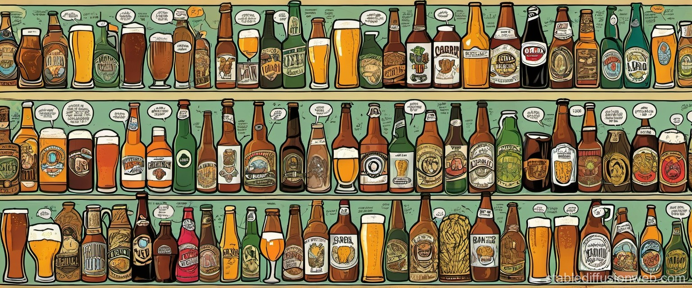

<div align="center">
  <picture>
    <source srcset="https://raw.githubusercontent.com/nhatminh-it/BeerCooler/duyle_dev/cover_image.jpg">
    
  </picture>
</div>
# BeerCooler [BeerClassification]

This project aims to accurately classify different beer types based on their logos using advanced machine learning models. It provides all the necessary scripts and resources for image-based beer classification, leveraging a pre-trained model to streamline the process. The project is designed to make it easy to identify beer brands through logo recognition, ensuring a scalable and efficient solution.

## Project Structure

```plaintext
BeerCooler
│
├── agent/
│   ├── agent_labeling.py         # Script for labeling agents
│   └── llm.py                    # Script interacting with large language model (LLM)
│
├── checkpoints/
│   ├── Florence-2-large/          # Pre-trained model Florence-2-large
│   └── sabeco-internal-classification_efficientnet_b7.pth  # Checkpoint for EfficientNet model
│
├── config/
│   └── config.yaml                # Configuration file for the model and settings
│
├── data/
│   └── latest_picture/            # Directory to store latest pictures for classification
│
├── logos/                         # Directory with logo images for beer classification
│   ├── 333.png
│   ├── lac_viet.png
│   ├── saigon_chill.png
│   ├── saigon_export.png
│   ├── saigon_gold.png
│   ├── saigon_larger.png
│   └── saigon_special.png
│
├── model/
│   ├── __init__.py                
│   ├── classifier.py              # Script for the beer classifier model
│   └── object_detect.py           # Script for object detection module
│
├── utils/
│   ├── get_image.py              
│   ├── plot.py                    # Utility for plotting images and results
│   └── utils.py                 
│
├── .gitignore                    
├── app.py                         
├── README.md                      
├── requirements.txt               # List of required dependencies for the project
├── streamlit_upload.py           
└── test.py          
```
-----
## Getting Started

### Prerequisites

- Python 3.x
- Required packages listed in `requirements.txt`

### Install Dependencies

Install the required Python packages using:

```bash
pip install -r requirements.txt             
```


## Running the Project

To run the project locally, follow these steps:

## Configuration

The configuration file `config/config.yaml` allows you to adjust various parameters, such as:

- Model checkpoints
- Data paths

[//]: # (- Hyperparameters for training)

## Model Checkpoints

There are two primary model checkpoints used in this project:

- **Florence-2-large**: A pre-trained model used for the initial image inference and classification.
- **sabeco-internal-classification_efficientnet_b7.pth**: A custom-trained EfficientNet B7 model for internal beer logo classification. You can download the checkpoint from [Google Drive](https://drive.google.com/drive/folders/1X04JLmLfvbvxlifgduOurI_vobz72OpW?usp=sharing).

### 1. Run the Classifier Application:
You can run the classifier using a Streamlit interface. To do this, execute the following command:

```bash
streamlit run streamlit_upload.py
```
This will start the web interface where you can upload images for classification.


-----------
# Features Developing

### 2. Model Training:
If you need to retrain the model, you can use the scripts provided in the `model/` directory:

- `classifier.py`: Handles inference for beer logo classification.
- `object_detect.py`: Detects objects within images.


-----------

## Agent Usage

### 1. Image Classification:
- Store your images or beer logos in the `logos/` directory or use the provided images.
- Run the classifier to identify the type of beer based on the logo image.

### 2. Labeling New Images:
- Use the `agent_labeling.py` script located in the `agent/` directory to label new images or beer categories.

### 3. LLM Integration:
- You can also use `llm.py` for additional processing or image description enhancements with a large language model.

## License

This project is licensed under the MIT License - see the [LICENSE](LICENSE) file for details.

